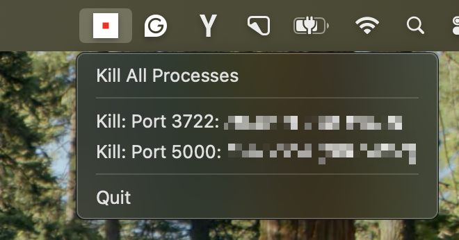

# 🚧 Port Kill

A lightweight cross-platform status bar app that monitors and manages development processes running on configurable ports. The app provides real-time process detection and allows you to kill individual processes or all processes at once.

**Supported Platforms:**
- ✅ **macOS**: Native system tray with full functionality
- ✅ **Linux**: Native system tray with full functionality (requires GTK packages)
- ✅ **Windows**: Native system tray with full functionality
- ✅ **Console Mode**: Works on all platforms without GUI dependencies



## Community & Support

Join our Discord community for discussions, support, and updates:

[](https://discord.gg/KqdBcqRk5E)

## Features

### Core Features (All Platforms)
- **Real-time Monitoring**: Scans configurable ports every 5 seconds using `lsof` commands
- **Process Detection**: Identifies processes by name, PID, and Docker containers
- **Safe Process Termination**: Uses SIGTERM → SIGKILL termination strategy
- **Configurable Port Ranges**: Monitor specific ports or port ranges
- **Ignore Lists**: Exclude specific ports or processes from monitoring
- **Docker Support**: Detect and display Docker container information
- **PID Display**: Optional PID display for better process identification
- **Graceful Error Handling**: Handles permission errors and process failures
- **Log Level Control**: Configurable logging verbosity (info, warn, error, none)

### Platform-Specific Features
- **macOS**: Native system tray with dynamic context menu and visual status icon
- **Linux**: Native system tray with dynamic context menu and visual status icon
- **Windows**: Native system tray with dynamic context menu and visual status icon
- **Console Mode**: Cross-platform console interface with real-time updates (recommended for full-screen mode)

### Advanced Features
- **Individual Process Killing**: Kill specific processes by clicking menu items
- **Bulk Process Killing**: Kill all detected processes with one click
- **Ignore Configuration**: Exclude system processes (Chromecast, AirDrop, etc.)
- **Docker Integration**: Display container names and IDs for Docker processes

## Status Bar Icon

The status bar icon provides instant visual feedback:

- **Green**: 0 processes (safe, no development servers)
- **Orange**: 1-9 processes (some development servers)
- **Red**: 10+ processes (many development servers)

Hover over the icon to see the exact process count in the tooltip.

## Menu Options

- **Kill All Processes**: Terminates all detected development processes
- **Individual Process Entries**: 
  - Docker containers: "Kill: Port 3001: node [Docker: my-react-app]"
  - Regular processes: "Kill: Port 3001: node" (or "Kill: Port 3001: node (PID 1234)" with `--show-pid`)
- **Quit**: Exits the application gracefully without affecting monitored processes

**Safety Features**: 
- The "Kill All Processes" option terminates only development processes (respects ignore lists)
- The "Quit" option exits the application without killing any processes
- Individual process killing respects ignore configurations

## Requirements

### macOS
- macOS 10.15 or later
- Rust 1.70 or later
- `lsof` command (included with macOS)
- Docker (optional, for container monitoring)

### Linux
- Linux with GTK support
- Rust 1.70 or later
- `lsof` command
- Docker (optional, for container monitoring)
- **Required packages for system tray**: `libatk1.0-dev libgdk-pixbuf2.0-dev libgtk-3-dev libxdo-dev`
- **Note**: If GTK packages are missing, the app automatically falls back to console mode

### Windows
- Windows 10 or later
- Rust 1.70 or later
- `netstat` command (included with Windows)
- `tasklist` command (included with Windows)
- Docker (optional, for container monitoring)

### Console Mode (All Platforms)
- Rust 1.70 or later
- `lsof` command (Unix-like systems)
- `netstat` command (Windows)
- Docker (optional, for container monitoring)
- **No GUI dependencies required**

## Installation

**⚠️ Important**: The first release is currently being prepared. If you get a "Not Found" error when using the install scripts, it means the release binaries haven't been published yet. Use the manual installation method below until the first release is available.

### Automated Releases

The latest binaries for all platforms are automatically built and released on GitHub when a release is published.

#### Quick Install (When Releases Are Available)
```bash
# macOS/Linux: Download and run the installer
curl -fsSL https://raw.githubusercontent.com/kagehq/port-kill/main/install-release.sh | bash

# Windows: Download and run the installer
# Option 1: Download and run manually
# Invoke-WebRequest -Uri 'https://raw.githubusercontent.com/kagehq/port-kill/main/install-release.bat' -OutFile 'install-release.bat'
# .\install-release.bat

# Option 2: One-liner (PowerShell)
# powershell -Command "Invoke-WebRequest -Uri 'https://raw.githubusercontent.com/kagehq/port-kill/main/install-release.bat' -OutFile 'install-release.bat'; .\install-release.bat"
```

**Note**: If no releases are available yet, the install scripts will guide you to build from source instead.

#### Manual Download (When Releases Are Available)
1. **Download from Releases**: Go to [GitHub Releases](https://github.com/kagehq/port-kill/releases) and download the appropriate binary for your platform
2. **Direct Downloads**:
   - **macOS**: `port-kill-macos` (system tray) or `port-kill-console-macos` (console mode)
   - **Linux**: `port-kill-linux` (system tray) or `port-kill-console-linux` (console mode)  
   - **Windows**: `port-kill-windows.exe` (system tray) or `port-kill-console-windows.exe` (console mode)
3. **Archive Downloads**: Compressed archives with both binaries for each platform

#### Creating a Release

**Option 1: Automated Release (Recommended)**
```bash
# Create a new release with automatic tag creation
./release.sh 0.x.x
```

This will:
1. Create a git tag `v0.x.x`
2. Push the tag to GitHub
3. Automatically trigger release creation
4. Build and upload binaries for all platforms

**Option 2: Manual Release**
1. Go to the repository on GitHub
2. Click "Releases" in the right sidebar
3. Click "Create a new release"
4. Set the tag version (e.g., `v0.x.x`)
5. Add a title and release notes
6. Click "Publish release"

Both methods will automatically trigger the build workflow and upload all platform binaries.

### Manual Installation

1. Clone the repository:
```bash
git clone <repository-url>
cd port-kill
```

2. Install and build (recommended):
```bash
./install.sh
```

Or manually:
```bash
./build-macos.sh
./run.sh
```

### Linux Installation

1. Clone the repository:
```bash
git clone <repository-url>
cd port-kill
```

2. Install required packages:
```bash
# Ubuntu/Debian
sudo apt-get install libatk1.0-dev libgdk-pixbuf2.0-dev libgtk-3-dev libappindicator3-dev

# Fedora/RHEL
sudo dnf install atk-devel gdk-pixbuf2-devel gtk3-devel libappindicator-gtk3-devel

# Arch Linux
sudo pacman -S atk gdk-pixbuf2 gtk3 libappindicator-gtk3
```

3. Install and build (recommended):
```bash
./install.sh
```

Or manually:
```bash
./build-linux.sh
./run-linux.sh
```

### Windows Installation

1. Clone the repository:
```bash
git clone <repository-url>
cd port-kill
```

2. Install Rust (if not already installed):
```bash
# Download and run rustup-init.exe from https://rustup.rs/
```

3. Install and build (recommended):
```bash
./install.sh
```

Or manually:
```bash
build-windows.bat
run-windows.bat
```

#### Windows Tray Icon (embedded)

To embed a proper tray icon in the Windows executable:

1) The source SVG lives at `assets/port-kill.svg`.

2) Convert it to a multi-size `.ico` (requires ImageMagick):

```bash
convert -background none assets/port-kill.svg -define icon:auto-resize=16,24,32,48,64,128,256 assets/port-kill.ico
```

3) Build on Windows (or let CI build). The build script (`build.rs`) will detect `assets/port-kill.ico` and embed it.

Notes:
- If the icon is missing, the app tries common resource fallbacks. If tray creation still fails, it automatically falls back to console mode.
- The code first attempts resource `APPICON`, then other common IDs.

### Console Mode (All Platforms)

Console mode works on all platforms without GUI dependencies:

```bash
# Build (works on any platform)
cargo build --release

# Run console mode
./target/release/port-kill-console --console --ports 3000,8000 --verbose
```


## Usage

### Basic Usage

**Platform-Specific Run Scripts:**
- **macOS**: Use `./run.sh` 
- **Linux**: Use `./run-linux.sh`
- **Windows**: Use `run-windows.bat`

1. **Start the Application**: Run the appropriate script for your platform with default settings (ports 2000-6000)
2. **Monitor Status**: Check the status bar for the process count indicator
3. **Access Menu**: Click on the status bar icon to open the context menu
4. **Kill Processes**: 
   - Click "Kill All Processes" to terminate all development processes
   - Click individual process entries to kill specific processes
5. **Quit**: Click "Quit" to exit the application

### Configurable Port Monitoring

The application now supports configurable port ranges and specific port monitoring:

#### Port Range Examples
```bash
# Monitor ports 3000-8080
./run.sh --start-port 3000 --end-port 8080          # macOS
./run-linux.sh --start-port 3000 --end-port 8080    # Linux
run-windows.bat --start-port 3000 --end-port 8080   # Windows

# Monitor ports 8000-9000
./run.sh -s 8000 -e 9000                            # macOS
./run-linux.sh -s 8000 -e 9000                      # Linux
run-windows.bat -s 8000 -e 9000                     # Windows
```

#### Specific Ports Examples
```bash
# Monitor only specific ports (common dev ports)
./run.sh --ports 3000,8000,8080,5000                # macOS
./run-linux.sh --ports 3000,8000,8080,5000          # Linux
run-windows.bat --ports 3000,8000,8080,5000         # Windows

# Monitor React, Node.js, and Python dev servers
./run.sh -p 3000,3001,8000,8080                     # macOS
./run-linux.sh -p 3000,3001,8000,8080               # Linux
run-windows.bat -p 3000,3001,8000,8080              # Windows
```

#### Console Mode
```bash
# Run in console mode for debugging
./run.sh --console --ports 3000,8000,8080

# Console mode with verbose logging
./run.sh -c -p 3000,8000,8080 -v

# Console mode with PIDs shown
./run.sh --console --show-pid --ports 3000,8000,8080

# Console mode for full-screen mode users (recommended)
./run.sh --console --log-level warn --ports 3000,8000,8080

#### Log Level Control
```bash
# Show all logs (default)
./run.sh --log-level info --ports 3000,8000

# Show only warnings and errors
./run.sh --log-level warn --ports 3000,8000

# Show only errors
./run.sh --log-level error --ports 3000,8000

# Show no logs (quiet mode)
./run.sh --log-level none --ports 3000,8000

# Verbose mode (overrides log-level)
./run.sh --verbose --ports 3000,8000
```

#### Docker Integration
```bash
# Monitor ports including Docker containers
./run.sh --docker --ports 3000,3001,8000,8080

# Monitor port range with Docker support
./run.sh -d -s 3000 -e 8080

# Console mode with Docker monitoring
./run.sh --console --docker --ports 3000,8000,8080
```

#### Ignoring System Processes
```bash
# Ignore common system ports (Chromecast, AirDrop, etc.)
./run.sh --ignore-ports 5353,5000,7000

# Ignore specific process names
./run.sh --ignore-processes Chrome,ControlCe,rapportd

# Combine both ignore options
./run.sh --ignore-ports 5353,5000,7000 --ignore-processes Chrome,ControlCe

# Console mode with ignore options
./run.sh --console --ignore-ports 5353,5000,7000 --ignore-processes Chrome,ControlCe
```

**Common System Processes to Ignore:**
- **Port 5353**: Google Chromecast service
- **Port 5000**: Apple AirDrop service (ControlCe)
- **Port 7000**: Apple AirDrop service
- **Process "Chrome"**: Google Chrome browser
- **Process "ControlCe"**: Apple Control Center/AirDrop
- **Process "rapportd"**: Apple Rapport service

**Docker Features:**
- Detects processes running inside Docker containers
- Shows container names prominently in the menu and console output (no PID for containers)
- Automatically stops containers when killing processes
- Uses `docker stop` for graceful termination, `docker rm -f` as fallback

#### All Command-Line Options
- `--start-port, -s`: Starting port for range scanning (default: 2000)
- `--end-port, -e`: Ending port for range scanning (default: 6000)
- `--ports, -p`: Specific ports to monitor (comma-separated, overrides start/end range)
- `--ignore-ports`: Ports to ignore (comma-separated, e.g., 5353,5000,7000 for Chromecast/AirDrop)
- `--ignore-processes`: Process names to ignore (comma-separated, e.g., Chrome,ControlCe)
- `--console, -c`: Run in console mode instead of status bar mode
- `--verbose, -v`: Enable verbose logging (overrides --log-level)
- `--log-level`: Control logging verbosity (info, warn, error, none) (default: info)
- `--docker, -d`: Enable Docker container monitoring (includes containers in process detection)
- `--show-pid, -P`: Show process IDs (PIDs) in the display output
- `--help, -h`: Show help information
- `--version, -V`: Show version information


## Technical Details

### Architecture

- **Main Thread**: Handles UI events and menu interactions with winit event loop
- **Process Monitor**: Scans for processes every 5 seconds using `lsof`
- **Menu Updates**: Updates context menu every 3 seconds when processes change
- **Process Killing**: Runs in background threads to maintain UI responsiveness

### Process Detection

The application uses the following command to detect processes:
```bash
lsof -ti :PORT -sTCP:LISTEN
```

### Process Termination

1. **SIGTERM**: First attempts graceful termination
2. **SIGKILL**: If process doesn't terminate within 500ms, forces termination
3. **Error Handling**: Gracefully handles permission errors and already-terminated processes

### Port Range

Monitors ports 2000-6000 (broad range covering common development server ports)

## Dependencies

- `tray-icon`: macOS status bar integration
- `winit`: Event loop management
- `nix`: Signal handling for process termination
- `crossbeam-channel`: Thread communication
- `tokio`: Async runtime
- `anyhow`: Error handling
- `serde`: Data serialization

## Development

### Building for Development

```bash
cargo build
```

### Running with Logging

```bash
RUST_LOG=info cargo run
```

### GitHub Actions

This project uses GitHub Actions for automated building and testing:

- **Build and Test** (`.github/workflows/build.yml`): Runs on pull requests and pushes to main/master
  - Builds binaries for all platforms (macOS, Linux, Windows)
  - Tests that binaries can run and show help
  - Tests console mode functionality

- **Build and Release** (`.github/workflows/release.yml`): Runs when a new release is published
  - Builds optimized binaries for all platforms
  - Creates compressed archives and individual binary files
  - Uploads all assets to the GitHub release

### Local Development

To test the build scripts locally:

```bash
# macOS
./build-macos.sh

# Linux  
./build-linux.sh

# Windows
build-windows.bat
```

## Troubleshooting

### Permission Issues

If you encounter permission errors when trying to kill processes:

1. Ensure the application has the necessary permissions
2. Some system processes may be protected
3. Check if the process is owned by another user

### Process Not Detected

If a process is not being detected:

1. Verify the process is listening on a port in the 2000-6000 range
2. Check if the process is using TCP (not UDP)
3. Ensure the process is in LISTEN state

### Application Not Starting

If the application fails to start:

1. Check if another instance is already running
2. Verify all dependencies are installed
3. Check system logs for error messages

### Full-Screen Mode Issues

If the system tray menu is not accessible when applications are in full-screen mode:

1. **Use Console Mode**: The most reliable solution is to use console mode:
   ```bash
   ./run.sh --console --ports 3000,8000
   ```

2. **Exit Full-Screen**: Temporarily exit full-screen mode to access the system tray

3. **Use Mission Control**: On macOS, use Mission Control (F3 or three-finger swipe up) to access the menu bar

4. **Alternative Access**: The app provides console output with process status updates, so you can monitor activity even when the menu is not accessible

### Linux System Tray Issues

If the Linux system tray is not working or processes are not showing:

1. **Run the debug script** to diagnose issues:
   ```bash
   ./debug_linux.sh
   ```

2. **Install GTK packages** (required for system tray):
   ```bash
   # Ubuntu/Debian
   sudo apt-get install libatk1.0-dev libgdk-pixbuf2.0-dev libgtk-3-dev libappindicator3-dev pkg-config
   
   # Fedora/RHEL
   sudo dnf install atk-devel gdk-pixbuf2-devel gtk3-devel libappindicator-gtk3-devel pkg-config
   
   # Arch Linux
   sudo pacman -S atk gdk-pixbuf2 gtk3 libappindicator-gtk3 pkg-config
   ```

3. **Use console mode** (works without GUI dependencies):
   ```bash
   ./run-linux.sh --console --ports 3000,8000 --verbose
   ```

4. **Check display environment**:
   - Ensure you're running in a desktop environment (not SSH without X11 forwarding)
   - Verify `DISPLAY` environment variable is set: `echo $DISPLAY`
   - Try running in a terminal emulator (not pure console)

5. **Common Linux issues**:
   - **Tray icon not showing**: Check if you're in a desktop environment with system tray support
   - **Processes not detected**: Verify `lsof` is installed and working: `lsof -i :3000`
   - **GTK errors**: Install missing GTK packages or use console mode
   - **Permission issues**: Run with appropriate permissions or use `sudo` if needed

6. **For detailed debugging**:
   ```bash
   RUST_LOG=debug ./run-linux.sh --console --ports 3000,8000
   ```

### Docker Issues

If Docker integration is not working:

1. Ensure Docker Desktop is running
2. Verify `docker` command is available in PATH
3. Check Docker permissions and access
4. Ensure containers are running and accessible
5. Try running with `--verbose` flag for detailed logging

## License

This project is licensed under the FSL-1.1-MIT License. See the LICENSE file for details.

## Contributing

1. Fork the repository
2. Create a feature branch
3. Make your changes
4. Add tests if applicable
5. Submit a pull request
